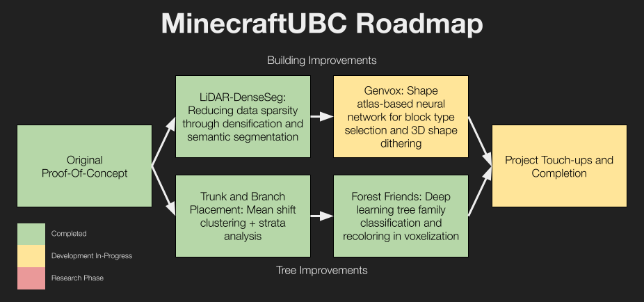

# minecraftUBC

The UBC Minecraft Project is a project that aims to recreate the UBC Vancouver Campus inside a Minecraft world, in a 1:1 scale. 

It's built by transforming LiDAR data, operational geospatial data, and various reference imagery through surface reconstruction, data processing, and deep learning algorithms. **Read more about how it's done in the [transformation pipeline document](docs/transformation_pipeline.md)**.

**Note: This project uses submodules. If you want to clone the deep learning modules and related subprojects, please clone with `git clone --recurse-submodules https://github.com/ashtanmistal/minecraftUBC.git`** If you just want to download the world, there's no need to clone the submodules.

## Server and World Download

**Note: The server is currently offline. Check out the [latest release](http://github.com/ashtanmistal/minecraftUBC/releases/latest) for the world download.**

If you're looking to check out the world on the server or want to chat about the project, please see the [Discord server](https://discord.gg/FqbDJNPgDu) where the IP address is shared.

[//]: # (Those regular backups to GitHub are available in this repository in the [server auto backups branch]&#40;https://github.com/ashtanmistal/minecraftUBC/tree/server-auto-backups&#41;, under the `world/UBC` directory. The master branch holds the latest "stable" version in case of corruption or other issues with the server. The world is backed up approximately every 12 hours. )

If you're looking for what the world looks like after various processing steps you can check out the `world/development_layers` directory in the latest release.

# Roadmap

Version 2.0 is the latest release of the project and was what was shared to social media in June and July of 2023, and includes the "Original Proof-Of-Concept" and "Trunk and Branch Placement" milestones.
Current development is focused on Version 3.0.

Version 3.0 will include the following features:
- Integration of [LiDAR-DenseSeg](https://github.com/ashtanmistal/LiDAR-DenseSeg) pipeline
- Integration of [Forest Friends](https://github.com/ashtanmistal/Forest-Friends) pipeline

## Project Contributors

The following people contributed to Version 2.0 of the project outside the manual building process:
- [Ashtan Mistal](https://github.com/ashtanmistal)
- [Hod Kimhi](https://github.com/hkimhi)
- [Eve Sankar](https://github.com/geminiev)
- [Bryce Wilson](https://github.com/Bryce-MW)

An exhaustive list of builders for Version 2.0 is available in the spreadsheet listed in the [building document](docs/building.md).

## Screenshots and Renders

The full album of screenshots is available in the [docs/screenshots](docs/screenshots) directory.

